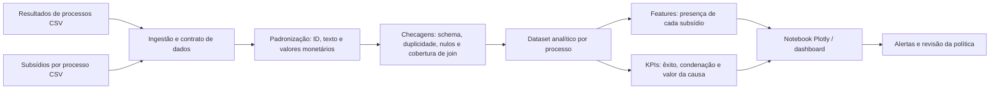

# Arquitetura enxuta de observabilidade de dados

## Objetivo

Dar visibilidade rápida à relação entre **subsídios disponíveis**, **perfil do processo** e **desfecho financeiro/judicial**, sem afirmar que uma correlação é causalidade. A primeira entrega é o notebook `notebooks/data_observability.ipynb`, que lê os dois CSVs locais e produz gráficos Plotly interativos.

## Fluxo proposto

## Dataset analítico mínimo

**Chave:** `numero_processo`.

| Grupo | Campos |
|---|---|
| Contexto | `uf`, `assunto`, `sub_assunto` |
| Desfecho | `resultado_macro`, `resultado_micro`, `valor_da_causa`, `valor_da_condenacao_indenizacao` |
| Evidência | `contrato`, `extrato`, `comprovante_de_credito`, `dossie`, `demonstrativo_de_evolucao_da_divida`, `laudo_referenciado` (0/1) |
| Métricas derivadas | `teve_nao_exito`, `razao_condenacao_causa`, `qtd_subsidios` |

## O que observar

1. **Confiabilidade:** volume, cobertura de join, colunas ausentes, IDs duplicados e nulos.
2. **Completude de defesa:** taxa de presença de cada subsídio e distribuição da quantidade de subsídios por caso.
3. **Correlação:** Pearson/phi entre os seis indicadores binários. Use para descobrir redundâncias ou combinações a investigar.
4. **Risco por segmento:** taxa de não êxito e valor médio/mediano de condenação por UF, subassunto e disponibilidade de subsídio.
5. **Acompanhamento operacional:** aderência à recomendação, taxa de acordo aceito, economia estimada e exceções justificadas. Estes últimos exigem eventos adicionais da operação de acordos.

## Pipeline em três etapas

| Etapa | Frequência | Saída | Regra de qualidade |
|---|---|---|---|
| Ingestão | diária | dados brutos versionados | schema esperado e ID não vazio |
| Transformação | diária | tabela `case_observability` | unicidade por processo, parse monetário e cobertura de join registrada |
| Consumo | diária/semanal | notebook/dashboard e alertas | métricas comparadas com baseline e janelas anteriores |

## Próxima evolução

Adicionar uma tabela de eventos da política (`recomendacao`, `decisao_advogado`, `valor_ofertado`, `aceite`, `motivo_excecao`, `data`) para fechar o ciclo de aderência e efetividade. Separe a análise observacional da decisão automatizada; toda recomendação deve ser auditável e revisável pelo time jurídico.
